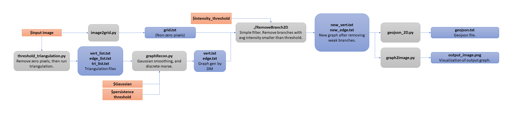

# MorseAnalysis
Discrete Morse

## Compile
Two modules need to be compiled. One is spt_cpp, the other one is RemoveBranch2D.

### Compile spt_cpp module
Under spt_cpp folder, call 'make' in command line.
Cmake (3.8 or +) need to be first installed. 

### Compile RemoveBranch2D module
Makefile attached in RemoveBranch2D folder.
Simply call 'make' in command line. 
Move the executable 'RemoveBranch2D' to the root folder.

## Run
See run.sh for how to run this pipeline. The following workflow will help understand input parameters, intermediate files and final outputs.

### Workflow

