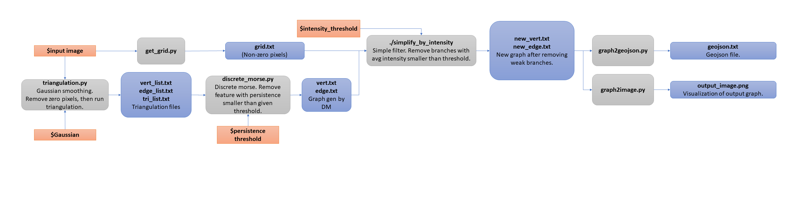

# MorseAnalysis
Discrete Morse

## Compile
Two modules need to be compiled. One is spt_cpp, the other one is simplify_by_intensity.

### Compile spt_cpp module
Under spt_cpp folder, call 'make' in command line.
Cmake (3.8 or +) need to be first installed. 

### Compile simplify_by_intensity module
Makefile attached in simplify_by_intensity folder.
Simply call 'make' in command line. 
Move the executable 'simplify_by_intensity' to the root folder.

## Run
See run.sh for how to run this pipeline. The following workflow will help understand input parameters, intermediate files and final outputs.

### Workflow
Red boxes are input variables, blue boxes represents outputs (intermediate or final outputs) and gray boxes are functions.

## Test
Test files and expected outputs are listed in dataset/Samik and result/Samik. The meaning of these files can be found in the workflow image above. For the test data set, persistent_threshold = 0.01, intensity_threshold = 0, GAUSSIAN = 0.

Also, there will be some other intermediate outputs, e.g., "presave.bin", "SC.bin" and "visualization.png", one can ignore these files for now. These files store the temporary outputs from discrete morse function, and will be detected & loaded if one reruns the code on the exactly same data set for the purpose of better efficiency. However, if one changes the input parameters, e.g., persistence threshold, the discrete morse function will still load the same presave.bin, which neglects the change of input parameters. **This issue need to be fixed**.
